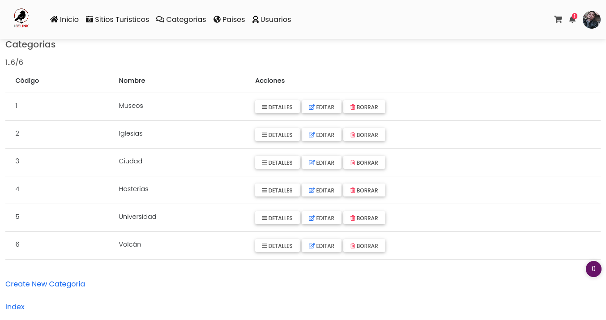

# WebAppTurismo

##  👇

Esta es una pequeña aplicación web para agregar sitios turisticos desarrollada en la plataforma **JAVA SERVER FACES 2.3** y como motor de base de datos **PostgreSQL**. Puedes conocer más sobre la plataforma JSF en  [IBM](https://www.ibm.com/docs/es/was/9.0.5?topic=files-javaserver-faces)*

<h1 align="center"> Aplicacion Web</h1>

 Pagina de Logeo y Registro

 

## Herramientas Backend y Frontend
---
Para correr esta aplicacion se necesita :

### Cliente

- Bootstrap 5: 
- Leaflet: 
- Animate.css: 
- JSF: 

### Servidor:

- JAVAEE 8
- Apache Netbeans 12
- PostgreSQL 11
- Payara Server 5.2
- JPA 
- Maven
---
## Descripción y contexto
---
Esto es un archivo README. Debe contener la documentación de soporte uso de la herramienta digital. Las siguientes secciones son las secciones recomendadas que debes poner incluir en cualquier herramienta digital. Puedes descargar este archivo para que te sirva como plantilla.

Asegúrate de empezar este archivo con una breve descripción sobre las funcionalidades y contexto de la herramienta digital. Sé conciso y al grano.

## Guía de usuario
---
Explica los pasos básicos sobre cómo usar la herramienta digital. Es una buena sección para mostrar capturas de pantalla o gifs que ayuden a entender la herramienta digital.
 	
## Como usar
---
Para editar el proyecto, descargar y abrir con Apache Netbeans 12, debe tener instalado Payara Server 5 o WildFly( para el servidor de Wildfly debe añadir las conexiones a Postgresql),

### Dependencias
Para evitar conflictos de dependencia, simplemente en Netbeans utilizar la opcion Build with dependencies

    Click derecho al proyecto , Build with dependencies.

## Cómo contribuir
---
Esta sección explica a desarrolladores cuáles son las maneras habituales de enviar una solicitud de adhesión de nuevo código (“pull requests”), cómo declarar fallos en la herramienta y qué guías de estilo se deben usar al escribir más líneas de código. También puedes hacer un listado de puntos que se pueden mejorar de tu código para crear ideas de mejora.

## Screen Shot
---
Login

 
Sitios Turisticos

 
Añadir un nuevo sitio

 
Categorias 

 
Paises

 

## Autor/es
---
Israelgm29 : email islandon24@gmail.com

